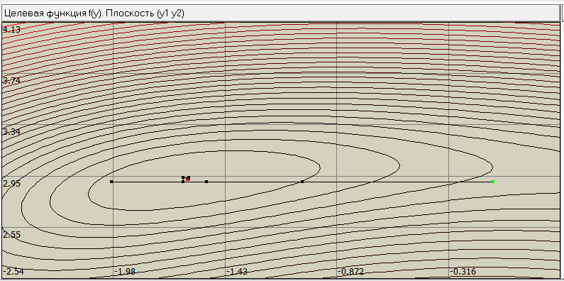
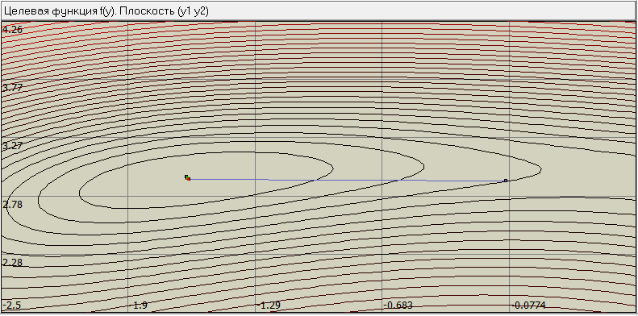
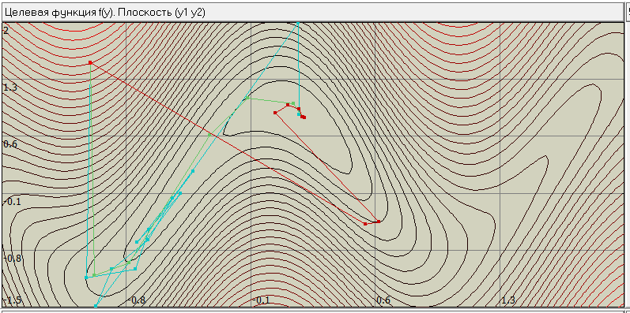
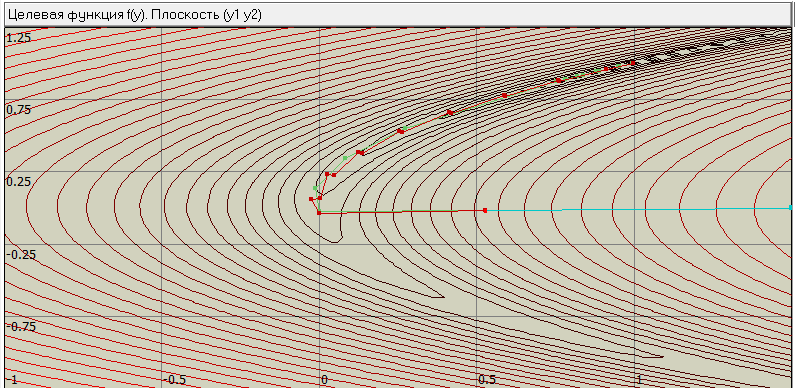
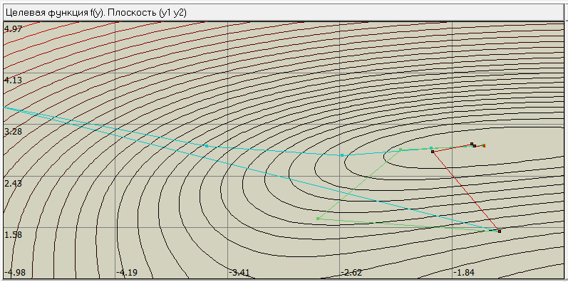

# Лабораторная работа №6

Пример, в котором направление поиска метода Хука-Дживса шло не лесинкой.
$$
    Q(x) = (x_1^2+x_2^2-11)^2 + (x_1+x_2^2-7)^2+x_1-x_2,\\
    -5 \le x_1 \le 4.5, \; -4.5 \le x_2 \le 5,\\
    x^0=(-0.09, \; 2.9).
$$

Метод Нелдера-Мида на этом же примере.

Примеры, в которых метод Ньютона, модифицированный метод Ньютона и квазиньютоновский метод ведут себя по разному из одной начальной точки. Метод Ньютона показан синими траекториями, модифицированный -- зелёным, квазиньютоновский -- красным.
$$
    Q(x) = 20(\cos{3x_1}-x_2)^2 + (x_2-4x_1)^2,\\
    -1.5 \le x_1 \le 2, \; -1.5 \le x_2 \le 2,\\
    x^0 = (-1, \; 1.5).
$$

$$
    Q(x) = \sqrt{\sqrt{100(x_1-x_2^2)^2 + (x_2-1)^2 + 0.03^2}},\\
    -1 \le x_1 \le 1.5, \; -1.25 \le x_2 \le 1.25,\\
    x^0 = (0.52, \; -0.02).
$$
Здесь метод Ньютона сошёлся в точку максимума в отличие от остальных.

$$
    Q(x) = (x_1^2+x_2^2-11)^2 + (x_1+x_2^2-7)^2+x_1-x_2,\\
    -5 \le x_1 \le 4.5, \; -4.5 \le x_2 \le 5,\\
    x^0=(-1.5, \; 1.5).
$$

